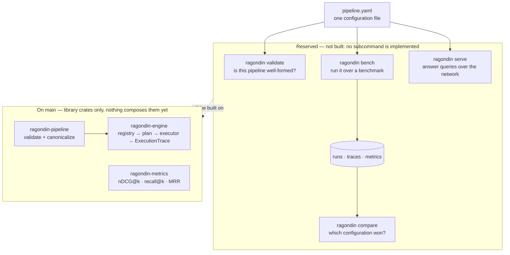

# Ragondin

An open-source, cloud-native platform — written in Rust — for **building,
serving, and evaluating Retrieval-Augmented Generation (RAG) systems**. You
compose a RAG pipeline from configurable primitives, run it, and rigorously
benchmark it, so you can answer *"which RAG configuration performs best on my
documents, at what cost and latency?"* with **reproducible numbers**.

## The design thesis

> **A small core of composable primitives, executed by a fast engine, from which
> most named RAG techniques emerge as configuration rather than code.**

Chunkers, embedders, retrievers, fusion, rerankers, context builders,
generators, graders — a handful of primitives wired into a pipeline graph.
"Hybrid retrieval", "corrective RAG", "RAG-fusion" and most other named
techniques are then *configurations* of that graph, not new code. A genuinely
new node type is added through an open `Extension` variant without touching the
core.

## Standalone first

The platform is designed to be driven by **a single binary and a configuration
file — no Kubernetes required**. Cloud-native operation is a later milestone
layered on top, never a prerequisite. Heavy backends (a sparse index, an ONNX
embedder, a vector store) each get their own crate behind a feature flag, so the
default build stays lean — none of them has been written yet, and `cargo build`
today pulls in no search engine, no inference runtime and no store client.

One binary, four subcommands — the whole user-facing surface:

```text
ragondin bench <config> --benchmark beir/scifact  # evaluate a pipeline against a benchmark
ragondin compare <run-a> <run-b>                  # compare two runs
ragondin serve <config>                           # serve the pipeline
ragondin validate <config>                        # validate a configuration
```

**None of the four is implemented yet.** That is the planned surface, not a
description of today; [§ Status](#status) says what is on `main`.

## Architecture in one breath

The load-bearing boundaries of the system are **not documented conventions —
they are crate boundaries the compiler refuses to violate.** The engine depends
only on traits; concrete components are leaves; the binary is the single
composition root. Evaluation and serving are two thin drivers over **one**
engine, so they cannot drift apart.

- **Why the system is designed this way** → [`docs/system-architecture.md`](docs/system-architecture.md)
- **Why the code is organized this way** → [`docs/code-architecture.md`](docs/code-architecture.md)
- **Individual decisions, each citable** → [`docs/adr/`](docs/adr/)
- **What is deliberately undecided** → [`docs/OPEN_QUESTIONS.md`](docs/OPEN_QUESTIONS.md)
- **Rules for contributors and agents** → [`AGENTS.md`](AGENTS.md) · [`CONTRIBUTING.md`](CONTRIBUTING.md)

## Build and test

```bash
cargo build            # lean default build
just check             # build + test + clippy + fmt + architecture invariants
```

`just check` is what CI runs; it must pass before any change merges.

## Status

**Pre-alpha. Milestone M1 — *Core contracts & engine skeleton* — is in
progress** (15 of its 17 issues are closed). M0 — *Foundations* — has met its
exit criterion; the five issues still open under it are `decision:` and
`record:` issues, not implementation work.

**There is no usable binary yet.** `ragondin` compiles and prints one line; none
of the four subcommands is implemented. Everything below is a library crate,
reachable from Rust or from a test, and nothing composes it end to end — no
composition root registers the components that now exist, so the engine still
has nothing wired to plan or execute.

On `main` today:

| Crate | What is there |
|---|---|
| `ragondin-types` | The core value types: `DocId`, `ChunkId`, `QueryId`, `Document`, `Chunk`, `Query`, `Embedding`, `ScoredChunk`. |
| `ragondin-pipeline` | The versioned `RawPipeline` wire schema, the `LogicalNode` model with its `Extension` variant, the port/`ValueKind` check, and the `RawPipeline → LogicalPipeline` validation and canonicalization pass. Content-addressed hashing over the canonical form (INV-8), as `LogicalPipeline::content_hash`. |
| `ragondin-contracts` | Five component traits — `Retriever`, `Fusion`, `Reranker`, `Embedder`, `VectorStore` — with their params and `ComponentError`. |
| `ragondin-engine` | `EngineContext` and the explicit component registry, physical planning (`LogicalPipeline` + registry → `PhysicalPipeline`), and an executor that returns its `ExecutionTrace` — on failure as well as on success. No `Branch` or `Loop`: no such node variant exists yet. |
| `ragondin-conformance` | The behavioural suite every implementation of a contract must pass. |
| `ragondin-metrics` | The deterministic retrieval metrics: nDCG@k, recall@k, precision@k, MRR, MAP@k. |
| `ragondin-config` | The `ConfigSource` abstraction and its `LocalFile` implementation: a YAML file read into `RawPipeline` and compiled to a `LogicalPipeline`, with a typed error that keeps an unreadable file, an unsupported schema version, a parse fault and an invalid graph apart. No `Stream` source — that is M6. |

Still compiling skeletons, each with a doc comment and a link test and no
behaviour: `ragondin-proto`, `ragondin-remote`,
`ragondin-server`, `ragondin-harness`, `ragondin-experiments`, and the
`ragondin` binary. `components/` now holds `ragondin-retriever-bm25` (BM25 over
tantivy), `ragondin-store-memory` (exact brute-force vector search),
`ragondin-fusion-rrf` (Reciprocal Rank Fusion) and `ragondin-retriever-dense`
(a query embedded and searched through a `VectorStore`); ONNX, Qdrant and the
rest are still M2 issues.

### What using it will look like

The picture below is the whole product surface. Only the lower half of it exists.



The dashed arrow is the work that has not happened: the crates exist, the
binary that wires them to a configuration file and a benchmark does not.

## License

Apache-2.0. See [`LICENSE`](LICENSE).
