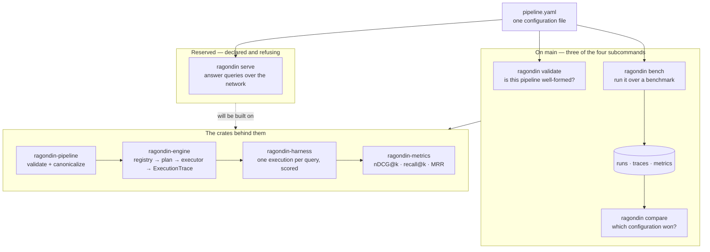

# Ragondin

An open-source, cloud-native platform — written in Rust — for **building,
serving, and evaluating Retrieval-Augmented Generation (RAG) systems**. You
compose a RAG pipeline from configurable primitives, run it, and rigorously
benchmark it, so you can answer *"which RAG configuration performs best on my
documents, at what cost and latency?"* with **reproducible numbers**.

## The design thesis

> **A small core of composable primitives, executed by a fast engine, from which
> most named RAG techniques emerge as configuration rather than code.**

Chunkers, embedders, retrievers, fusion, rerankers, context builders,
generators, graders — a handful of primitives wired into a pipeline graph.
"Hybrid retrieval", "corrective RAG", "RAG-fusion" and most other named
techniques are then *configurations* of that graph, not new code. A genuinely
new node type is added through an open `Extension` variant without touching the
core.

## Standalone first

The platform is designed to be driven by **a single binary and a configuration
file — no Kubernetes required**. Cloud-native operation is a later milestone
layered on top, never a prerequisite. Heavy backends (a sparse index, an ONNX
embedder, a vector store) each get their own crate behind a feature flag, so the
default build stays lean — none of them has been written yet, and `cargo build`
today pulls in no search engine, no inference runtime and no store client.

One binary, four subcommands — the whole user-facing surface:

```text
ragondin bench <config> --benchmark beir/scifact --datasets <dir> --store <dir>  # evaluate a pipeline against a benchmark
ragondin compare <run-a> <run-b> --store <dir>                                   # compare two runs
ragondin serve <config>                                                          # serve the pipeline
ragondin validate <config>                                                       # validate a configuration
```

**None of the four is implemented yet.** That is the planned surface, not a
description of today; [§ Status](#status) says what is on `main`.

## Architecture in one breath

The load-bearing boundaries of the system are **not documented conventions —
they are crate boundaries the compiler refuses to violate.** The engine depends
only on traits; concrete components are leaves; the binary is the single
composition root. Evaluation and serving are two thin drivers over **one**
engine, so they cannot drift apart.

- **Why the system is designed this way** → [`docs/system-architecture.md`](docs/system-architecture.md)
- **Why the code is organized this way** → [`docs/code-architecture.md`](docs/code-architecture.md)
- **Individual decisions, each citable** → [`docs/adr/`](docs/adr/)
- **What is deliberately undecided** → [`docs/OPEN_QUESTIONS.md`](docs/OPEN_QUESTIONS.md)
- **Rules for contributors and agents** → [`AGENTS.md`](AGENTS.md) · [`CONTRIBUTING.md`](CONTRIBUTING.md)

## Build and test

```bash
cargo build            # lean default build
just check             # build + test + clippy + fmt + architecture invariants
```

`just check` is what CI runs; it must pass before any change merges.

## Status

**Pre-alpha.** Milestones M0 — *Foundations* — M1 — *Core contracts & engine
skeleton* — and M2 — *First defensible deliverable (BEIR retrieval bench)* —
have every one of their issues closed. M3 — *Generation & end-to-end RAG* — is
next. The issues open outside any milestone are decisions reserved for a human,
work blocked on one of those decisions, ADR follow-ups, documentation defects,
and one dependency advisory exception.

M2's exit criterion is asserted mechanically rather than claimed:
`bin/ragondin/tests/exit_criterion.rs` drives the binary over a curated fixture
and requires hybrid retrieval with reranking to beat dense-only, reproducibly.
Beside it, `bin/ragondin/tests/calibration.rs` — ignored by default, run by
`just calibrate` against models and a dataset that live outside the tree —
reproduces the nDCG@10 that MTEB publishes for a pinned sentence encoder on BEIR
SciFact, and measures the same criterion on that real data.

**Three of the four subcommands are implemented.**
`bin/ragondin/ARCHITECTURE.md` § What lives here carries the current list and what each one does; `serve` is the one that parses
its arguments and then reports that this build does not implement it. `bench` is
where the composition root does its job: it loads a configuration, reads a
benchmark from disk, prepares the corpus, registers the concrete components this
build carries on an `EngineContext`, executes the pipeline once per query, scores
the judged ones and writes the run to a run store. So the end-to-end path is
reached from a subcommand, over real components, and no longer only from a test.
`bin/ragondin/tests/vertical_slice.rs` still assembles the same composition root
over the deterministic stubs, where what is asserted is the wiring — a plan, and
the trace the executor returns — rather than a retrieval result.

On `main` today:

| Crate | What is there |
|---|---|
| `ragondin-types` | The core value types: `DocId`, `ChunkId`, `QueryId`, `Document`, `Chunk`, `Query`, `Embedding`, `ScoredChunk`; and the generation-side values `Context`, `ContextChunk`, `Answer`, `ModelIdentity` (ADR-C31 § 1). |
| `ragondin-pipeline` | The versioned `RawPipeline` wire schema, the `LogicalNode` model with its `Extension` variant, the port/`ValueKind` check, and the `RawPipeline → LogicalPipeline` validation and canonicalization pass. Content-addressed hashing over the canonical form (INV-8), as `LogicalPipeline::content_hash`. |
| `ragondin-contracts` | Seven component traits — `Retriever`, `Fusion`, `Reranker`, `Embedder`, `VectorStore`, `ContextBuilder`, `Generator` — with their params and `ComponentError`. |
| `ragondin-engine` | `EngineContext` and the explicit component registry, physical planning (`LogicalPipeline` + registry → `PhysicalPipeline`), and an executor that returns its `ExecutionTrace` — on failure as well as on success. No `Branch` or `Loop`: no such node variant exists yet. |
| `ragondin-conformance` | The behavioural suite every implementation of a contract must pass. |
| `ragondin-metrics` | The deterministic metrics: nDCG@k, recall@k, precision@k, MRR and MAP@k for retrieval; exact match and token-F1, after the SQuAD v1.1 script, for generation. |
| `ragondin-proto` | The protobuf face of the component contract (package `ragondin.v1`): the `Retriever`, `Fusion`, `Reranker`, `Embedder` and `VectorStore` services, stubs generated at build time with no `protoc` (ADR-C34), and a reserved, empty configuration-delivery service. Not mirrored yet, arriving with #257: `GetModelIdentity`, `served_model`, and the `ContextBuilder` and `Generator` services. |
| `ragondin-config` | The `ConfigSource` abstraction and its `LocalFile` implementation: a YAML file read into `RawPipeline` and compiled to a `LogicalPipeline`, with a typed error that keeps an unreadable file, an unsupported schema version, a parse fault and an invalid graph apart. No `Stream` source — that is M6. |
| `ragondin-benchmarks` | The `BenchmarkAdapter` trait, the internal `Benchmark` structure it produces — corpus, queries, `Qrels`, `ReferenceAnswers` — with the pieces it carries reported by `Benchmark::carries`; `BeirAdapter`, which reads a BEIR dataset from disk and, on request, its `answers.jsonl` as reference answers; and `SquadAdapter`, which reads a SQuAD v1.1 file as a retrieval corpus with reference answers. |
| `ragondin-harness` | The evaluation driver: `evaluate` takes a validated `LogicalPipeline`, a ready `EngineContext` and a loaded `Benchmark`, runs the pipeline once per query through `ragondin-engine`, scores the rankings against the qrels, and assembles the `Run` that names itself by its content-addressed identity. No execution logic of its own (ADR-4). |
| `ragondin-experiments` | The run store — `RunId`, `Run`, `FileSystemRunStore` — and the `compare` behind `ragondin compare`: metric by metric, and which configuration parameters two runs differ in. No export adapter, no registry, no user interface. |
| `ragondin-retriever-bm25` | BM25 over tantivy. |
| `ragondin-retriever-dense` | A query embedded and searched through a `VectorStore`. |
| `ragondin-embedder-onnx` | In-process embeddings over ONNX Runtime: mean-over-mask pooling and L2 normalization. |
| `ragondin-reranker-onnx` | An in-process cross-encoder over the same runtime. |
| `ragondin-fusion-rrf` | Reciprocal Rank Fusion. |
| `ragondin-context-concat` | A context builder: chunks concatenated in order under a character budget. |
| `ragondin-store-memory` | Exact brute-force vector search, in memory. |
| `ragondin-stub` | The deterministic stubs the wiring tests are assembled over. |
| `ragondin` | The binary and the composition root: `validate`, `compare` and `bench` implemented, `serve` declared and refusing. |

Every heavy backend sits behind a feature, so the default build stays lean: the
binary's `bm25` feature is what pulls tantivy in, and its `onnx` feature ONNX
Runtime and the components composed over it.

Still compiling skeletons, each with a doc comment and a link test and no
behaviour: `ragondin-remote` and `ragondin-server` — the generic `Remote<T>`
adapters and the serving driver, each waiting on its own issue. A
`VectorStore` over Qdrant is one of those too.

### What using it will look like

The picture below is the whole product surface. One subcommand of it does not
exist yet.



The dashed arrow is the work that has not happened: `ragondin-server` is a
skeleton, so `serve` has nothing to dispatch to. The solid one is `bench`, which
takes a configuration file through the engine and the harness to a recorded run,
and `compare`, which reads two of those runs back.

## License

Apache-2.0. See [`LICENSE`](LICENSE).
