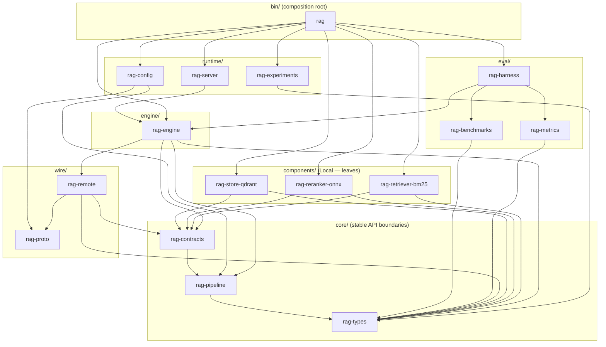
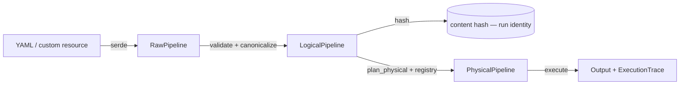
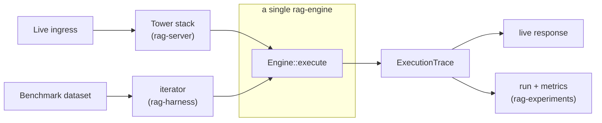

# Code Architecture

| | |
|---|---|
| **Project** | RAG evaluation and serving platform (codename pending) |
| **Status** | Architecture proposal — submitted for review |
| **Version** | 0.2 |
| **Parent document** | *System Architecture*. This document is its translation into code organization and must be read after it. |
| **Audience** | Software architects, Rust leads, prospective contributors |
| **Target language** | Rust (2021 edition or later), multi-crate Cargo workspace |

> **How to read this document.** It describes a *target code architecture*. The Rust and protobuf excerpts are **contract and signature illustrations**, meant to make decisions concrete and reviewable — not production code.
>
> For a review, the most important sections are **§5 (invariants)**, **§12 (anti-decisions)**, **§13 (decision record)** and **§15 (open questions)**.

---

## Table of contents

1. [Executive summary](#1-executive-summary)
2. [Objectives, constraints, non-objectives](#2-objectives-constraints-non-objectives)
3. [Precedents](#3-precedents)
4. [The workspace](#4-the-workspace)
5. [Architecture invariants](#5-architecture-invariants)
6. [The pipeline representation, in three levels](#6-the-pipeline-representation-in-three-levels)
7. [The component contract, in code](#7-the-component-contract-in-code)
8. [The engine](#8-the-engine)
9. [Serving and evaluation: one engine, two drivers](#9-serving-and-evaluation-one-engine-two-drivers)
10. [The extension model](#10-the-extension-model)
11. [Cross-cutting concerns](#11-cross-cutting-concerns)
12. [Anti-decisions](#12-anti-decisions)
13. [Decision record](#13-decision-record)
14. [Risks and mitigations](#14-risks-and-mitigations)
15. [Open questions](#15-open-questions)
16. [Traceability to the system architecture](#16-traceability-to-the-system-architecture)
17. [Glossary](#17-glossary)

---

## 1. Executive summary

This document defines the code organization of the platform as a **multi-crate Cargo workspace**, designed to remain maintainable over years and to support **broad external contribution** — including from researchers who do not write Rust — without compromising the performance-critical path.

**The single organizing principle**, from which everything else follows:

> **The load-bearing boundaries of the architecture are not documented — they are made physically impossible to violate by the compiler.**

Cargo forbids dependency cycles between crates. By routing the architecture's important boundaries through *crate* boundaries rather than module boundaries, those boundaries stop being conventions that decay and become **constraints the compiler refuses to violate**. Where Cargo alone cannot enforce a rule, CI does.

Four decisions structure the code:

1. **A three-level pipeline representation** — `RawPipeline` → `LogicalPipeline` → `PhysicalPipeline`. The logical level is canonical and content-addressed; the physical level resolves implementations. An open `Extension` variant prevents any new technique from forcing a change to the core.
2. **An embeddable engine library**, parameterized by an explicit `EngineContext` (the component registry) — **never** global state. Binaries are thin shells.
3. **A two-faced component contract** (Rust trait plus protobuf service) in which built-in and third-party components share *exactly* the same API, backed by a **conformance test suite** guaranteeing `Local`/`Remote` equivalence.
4. **A Tower-based serving layer** for the network envelope, kept strictly distinct from the engine's domain traits.

Governance follows the discipline of writing invariants **into the code**: each load-bearing crate declares whether it is a **stable API boundary** or **internal and freely refactorable**.

---

## 2. Objectives, constraints, non-objectives

### 2.1 Objectives

- **Compiled boundaries.** The three system contracts become boundaries the compiler defends.
- **Low-friction external contribution.** A researcher can contribute a component in Python (`Remote`) without compiling the workspace, or in Rust (`Local`) by compiling only the contracts crate.
- **Longevity.** A stable core with volatile edges. The core changes rarely; components and rules evolve at the periphery without shockwaves.
- **Embeddability.** The engine is a library reusable outside our own binaries.
- **Standalone first.** The default build is lean and compiles fast; heavy backends are optional.
- **Structural absence of evaluation/serving skew.** One engine, two thin drivers.

### 2.2 Constraints

- Stable Rust — no nightly dependency on the critical path.
- A single Cargo workspace; the Kubernetes controller may live outside it (§15).
- `tokio` on the hot path. Dynamic dispatch is unavoidable: `Local` and `Remote` are indistinguishable at compile time.

### 2.3 Non-objectives (v0)

- No fine-grained incrementality framework (§12).
- No plan optimizer — the logical-to-physical seam exists, but the optimizer is the identity function (§6.3, §12).
- No dynamic plugin loading (`dlopen`, WebAssembly). Extension happens through a recompiled `Local` crate or a `Remote` endpoint (§10).

---

## 3. Precedents

The architecture is not invented from nothing. It capitalizes on established, durable projects.

| Project | Domain | What is borrowed |
|---|---|---|
| **rust-analyzer** | Rust IDE backend | **Strict layering** — each layer depends only on lower layers. **Architecture invariants written into the code.** Explicit designation of **API boundaries** versus internal crates. The principle that the core tree is a **value type**: no global context, no I/O. |
| **Apache DataFusion** | Analytical query engine, Rust | **Logical/physical plan separation.** The plan as a **closed enum with an open `Extension` variant**. **Identical APIs for built-in and user-defined operators.** A **registry on an explicit context object**, not a global. An **embeddable library** rather than a standalone application. **Plan serialization** treated as a first-class, separate concern. |
| **linkerd2-proxy** | Service-mesh data plane, Rust | A **pure-compute, lightweight data plane**. A **Tower** `Service`/`Layer` stack for the network envelope. **Many small crates**, compiled and tested independently. |

**The common meta-lesson, and the through-line of this document:** longevity comes from **materialized boundaries** (crates plus written invariants), a stable core surrounded by trait-based extension points, and an explicit composition root rather than global state.

---

## 4. The workspace

### 4.1 Layout

```
workspace/
├── Cargo.toml                 # [workspace] + [workspace.dependencies] — versions centralized here
│
├── core/                      # THE CORE — stable API boundaries, no heavy dependencies
│   ├── rag-types              # Document, Chunk, Query, Embedding, ScoredChunk, Context, Generation
│   │                          #   Value types. serde only. No I/O, no globals.
│   ├── rag-pipeline           # RawPipeline → LogicalPipeline → PhysicalPipeline
│   │                          #   Graph, control flow, Extension variant, canonical hashing
│   └── rag-contracts          # Traits: Chunker, Embedder, Indexer, Retriever, Fusion, Reranker,
│                              #   ContextBuilder, Generator, Grader, VectorStore
│                              #   This is what a contributor implements.
│
├── wire/                      # Serialization and remote components
│   ├── rag-proto              # tonic-build: component service definitions + the configuration service
│   └── rag-remote             # Generic Remote<T> adapters; domain ⇄ protobuf conversions
│
├── engine/
│   └── rag-engine             # EngineContext (registry), physical planning, executor, ExecutionTrace
│                              #   Depends on contracts + pipeline + types. INTERNAL — never an API boundary.
│
├── components/                # The Local extension surface. One crate per implementation. Feature-gated.
│   ├── rag-retriever-bm25     # in-process sparse retrieval (tantivy)
│   ├── rag-retriever-dense    # dense retrieval through a VectorStore
│   ├── rag-embedder-onnx      # in-process embeddings (ONNX Runtime)
│   ├── rag-reranker-onnx      # in-process cross-encoder
│   ├── rag-store-qdrant       # VectorStore implementation
│   └── …                      # each: rag-contracts + rag-types + its own heavy dependency
│
├── eval/
│   ├── rag-metrics            # nDCG@k, recall@k, MRR (deterministic); generation metrics later
│   ├── rag-benchmarks         # BenchmarkAdapter + adapters (BEIR, CRAG, MultiHop-RAG…)
│   └── rag-harness            # Evaluation harness: benchmark → engine → metrics → run
│
├── runtime/
│   ├── rag-config             # ConfigSource (LocalFile | Stream); schema; parse → validate → compile
│   ├── rag-server             # Serving: ingress → Tower stack → engine
│   └── rag-experiments        # Native run store, registry, the API the UI consumes
│
├── testkit/
│   └── rag-conformance        # The suite every component implementation must pass (Local or Remote)
│
└── bin/
    └── rag                    # THE binary. Subcommands: bench, compare, serve, validate.
                               #   The composition root.
```

**Naming conventions**, so that the structure is self-explanatory:

- Components follow `rag-<role>-<implementation>` — `rag-reranker-onnx`, `rag-store-qdrant`. The pattern is guessable rather than memorized.
- Suffixes are the words a newcomer would use: `pipeline`, not `ir`; `harness`, not `eval-driver`; `server`, not `serving`.
- Plurals where the crate holds many things: `rag-benchmarks` (many adapters), `rag-experiments` (many runs).

### 4.2 One binary, four subcommands

A single binary, `rag`, is the composition root and the entire user-facing surface:

```
rag bench <config> --benchmark beir/scifact    # evaluate a pipeline against a benchmark
rag compare <run-a> <run-b>                    # compare two runs
rag serve <config>                             # serve the pipeline
rag validate <config>                          # validate a configuration
```

**Rationale.** Separate binaries for the data plane and the command-line workflow would force a user to understand the internal architecture before running anything. One subcommanded binary makes the standalone-first promise (P2) real: **one binary, one configuration file, it runs.**

This is a **packaging decision, not an architectural one**. The serving driver and the evaluation harness remain distinct crates over the same engine; the single-engine invariant (P1) is untouched. The binary merely exposes them through one door.

### 4.3 The dependency graph

Dependency arrows **always point toward the core**. None points back. Cargo guarantees acyclicity.



**Normative reading of the graph:**

- `rag-engine` depends on `rag-contracts` (the traits) but on **no crate under `components/`**. This is load-bearing rule number one.
- Crates under `components/` depend on `rag-contracts` and `rag-types` and **never the reverse**. A component is a **leaf**.
- Only the **binary** knows both the engine and the concrete components. It is the **composition root**.
- `rag-types` is the ultimate leaf: everything depends on it; it depends on almost nothing.

---

## 5. Architecture invariants

Following rust-analyzer's practice, each load-bearing crate documents its invariants in an `ARCHITECTURE.md`, and the status of every boundary is stated explicitly. These invariants are **normative**: violating one violates the architecture.

| # | Invariant | Crates | Precedent |
|---|---|---|---|
| **INV-1** | **Stable API boundaries** — versioned; breaking them is a deliberate, costly act. | `rag-types`, `rag-pipeline`, `rag-contracts` | rust-analyzer's syntax crate |
| **INV-2** | **`rag-engine` is NOT, and will NEVER be, an API boundary.** Full freedom to refactor. | `rag-engine` | rust-analyzer's internal crates |
| **INV-3** | **Value types** — `rag-types` and `rag-pipeline` have no global context, no interner, no I/O. Fully determined by their content. | `core/` | "the syntax tree is a value type" |
| **INV-4** | **The core is light** — `rag-types` and `rag-contracts` depend on **no heavy library** (no tantivy, tonic, ONNX Runtime, candle, vector-store client, HTTP client). `serde` at most. *(CI-enforced)* | `core/` | — |
| **INV-5** | **The engine knows only traits** — `rag-engine` lists **no crate under `components/`** in its `Cargo.toml`. *(CI-enforced)* | `rag-engine` | DataFusion trait-based operators |
| **INV-6** | **Explicit composition, zero globals** — the registry lives on an `EngineContext` passed as a parameter. No static global registry. | `rag-engine` | DataFusion's session context |
| **INV-7** | **No privilege for built-ins** — a built-in component registers through exactly the same mechanism as a third-party one. | `rag-engine`, `components/` | DataFusion: built-in = user-defined API |
| **INV-8** | **The hash is over the canonical logical form**, never over source text. | `rag-pipeline` | — |
| **INV-9** | **The wire format is separate from the in-memory representation** and versioned independently. | `rag-config`, `rag-proto` | DataFusion plan serialization |
| **INV-10** | **Traces are an OUTPUT of execution**, not logs. | `rag-engine` | — |
| **INV-11** | **Tower governs the network envelope, not the domain contract.** | `rag-server` vs `rag-contracts` | linkerd2-proxy |

---

## 6. The pipeline representation, in three levels

The first structuring decision, refined from DataFusion's logical/physical plan separation. Home: `rag-pipeline`.

### 6.1 The three levels

| Level | Role | Produced by | Key property |
|---|---|---|---|
| `RawPipeline` | **Permissive** deserialization target — strings, unresolved references | `serde`, from YAML or protobuf | May be malformed. **Never executed.** |
| `LogicalPipeline` | **Validated, canonical** form — names each implementation, resolves none | Validation and canonicalization pass | **Content-addressed.** Serializable. A value type. |
| `PhysicalPipeline` | Implementations **resolved** to trait objects; defaults applied | Physical planning, using the registry | Ready to execute. Holds `Box<dyn>` — not serializable. |

**Why three levels and not two.** A single validated level would have to be both the content-addressed artifact and the executable one, and it cannot be: resolved implementations are `Box<dyn>` trait objects, so that level is not serializable and cannot be hashed. Separating them also keeps two operations out of the hashed form — applying implementation defaults, and resolving an `Extension` node's kinds from the registry (ADR-C16) — so a configuration's identity does not shift with the registry it was planned against, and `rag validate` works with no `EngineContext` at all.

The logical hash identifies a configuration **completely, backend included**: `impl: qdrant_dense` is part of the logical form, so two backends are two hashes. That is deliberate — a run's identity must suffice to reproduce it (P4), and the configuration promoted from bench to serving must pin the backend it was measured on (P1). Comparing *"same RAG strategy, different backends"* is a **projection** over the logical form that elides `implementation`, not a property of the hash. See ADR-C2 § Amendments.

Content addressing (P4) is computed over the **canonical form of `LogicalPipeline`**, never over the YAML text: two semantically equivalent configurations formatted differently **must** hash identically, or reproducibility is an illusion (INV-8).

### 6.2 The `Extension` variant

Directly inspired by DataFusion's extension node. The representation is a **closed enum of primitive nodes plus an open `Extension` variant** carrying a node defined outside the core:

```rust
pub enum LogicalNode {
    Retriever(RetrieverNode),
    Fusion(FusionNode),
    Reranker(RerankerNode),
    Generator(GeneratorNode),
    Grader(GraderNode),
    Branch(BranchNode),         // first-class control flow
    Loop(LoopNode),             // bounded loop — termination guard mandatory
    Extension(ExtensionNode),   // escape hatch: a node defined outside the core
}
```

**Governance consequence.** A researcher who invents a genuinely new node type goes through `Extension` **without modifying the core**. The architecture's quality metric (§3.2 of the system document) is thereby refined: *what fraction of techniques require not even `Extension`?* Repeated use of `Extension` for the same shape is the signal to promote that shape into a primitive node.

### 6.3 The logical-to-physical seam

**Physical planning** takes a `LogicalPipeline` plus an `EngineContext` (the registry) and produces a `PhysicalPipeline`: it resolves each `impl: "bm25"` into a constructed component (`Local` or `Remote`), applies default parameters, and verifies end-to-end type compatibility.



**v0 decision.** The seam exists — it is an architectural boundary that is expensive to introduce after the fact — but the optimization phase between logical and physical is **the identity function** at first. We reserve the optimizer's place; we do not build the optimizer. (DataFusion's optimizer is an entire subsystem.)

---

## 7. The component contract, in code

Home: `rag-contracts` (face 1), `rag-proto` and `rag-remote` (face 2).

### 7.1 Two mirror faces

**Face 1 — the Rust trait**, implemented by `Local` components:

```rust
#[async_trait]
pub trait Reranker: Send + Sync {
    async fn rerank(
        &self,
        query: &Query,
        chunks: Vec<ScoredChunk>,
        params: &RerankParams,
    ) -> Result<Vec<ScoredChunk>, ComponentError>;
}
```

**Face 2 — the protobuf service**, implemented by `Remote` components:

```proto
service Reranker {
  rpc Rerank(RerankRequest) returns (RerankResponse);
}
```

**The generic `Remote<T>` adapter** (`rag-remote`) implements the trait by delegating over gRPC. The engine never distinguishes the two: both are `Box<dyn Reranker>`.

```rust
// rag-remote: a struct implementing the domain trait by speaking protobuf
pub struct RemoteReranker { client: RerankerClient<Channel> }

#[async_trait]
impl Reranker for RemoteReranker {
    async fn rerank(&self, q: &Query, chunks: Vec<ScoredChunk>, p: &RerankParams)
        -> Result<Vec<ScoredChunk>, ComponentError>
    {
        // domain → protobuf → gRPC → protobuf → domain
    }
}
```

### 7.2 Source of truth and face synchronization

**Decision.** The **domain types (`rag-types`) are the source of truth**, hand-written for Rust ergonomics. The protobuf is generated by `tonic-build`. `rag-remote` supplies the `From`/`Into` conversions.

The two faces are kept in lockstep by **round-trip property tests**:

```
for all x in domain:   from_proto(to_proto(x)) == x
```

This test is what prevents the two faces from silently diverging as the code evolves. It is the serialization-side counterpart of the conformance suite (§7.4).

### 7.3 Async traits and object safety

Dynamic dispatch is **mandatory**: it is impossible to know at compile time whether a node is `Local` or `Remote`. Three options exist for `dyn`-compatible async traits:

| Option | Cost | Verdict |
|---|---|---|
| `async_trait` (macro) | Boxes each future — one allocation per call | **Chosen for v0.** Simple, proven, `dyn`-compatible without friction. |
| Native `async fn` in traits (RPITIT) | No boxing, but `dyn`-compatibility is not automatic | Later, for hot-path traits, if profiling justifies it |
| Hand-boxed futures | Verbose | Special cases only |

**Rationale.** On the hot path, a node's real work — an embedding forward pass, a vector search, a network round trip — dwarfs the cost of boxing by orders of magnitude. Simplicity wins in v0; the optimization is local and reversible.

The same reasoning justifies the dynamic dispatch itself: the vtable indirection is negligible next to the work being dispatched, and the flexibility it buys — `Local` and `Remote` indistinguishable to the engine — is the foundation of the entire contribution model.

### 7.4 The conformance suite (`rag-conformance`)

So that `Local`/`Remote` equivalence is **real rather than asserted**: a suite of behavioural tests that **every** implementation of a contract must pass, whatever its nature. A contributor — built-in or third-party — plugs their component into the suite and obtains a conformance guarantee.

This is what operationally enforces INV-7. Without it, "no privilege for built-ins" is a slogan.

---

## 8. The engine

Home: `rag-engine`. Status: **internal** (INV-2).

### 8.1 `EngineContext` — the composition root

Modelled on DataFusion's session context. The context carries the **registry**: a table mapping an implementation name to a component constructor. It is **passed explicitly, never global** (INV-6), which allows several distinct contexts to be instantiated in one process — indispensable for the evaluation harness comparing two configurations side by side.

```rust
pub struct EngineContext {
    retrievers: Registry<dyn Retriever>,
    rerankers:  Registry<dyn Reranker>,
    // … one registry per component family
}

impl EngineContext {
    pub fn register_reranker(&mut self, name: &str, ctor: RerankerCtor) { /* … */ }

    // used by physical planning:
    pub(crate) fn build_reranker(&self, name: &str, p: &RerankParams)
        -> Result<Box<dyn Reranker>, PlanError> { /* … */ }
}
```

### 8.2 The executor and its traces

**Structuring decision (INV-10).** The executor's signature **returns** the traces; it does not log them. The differentiating UI capability — per-node replay — requires it: traces are structured business data, not telemetry.

```rust
pub struct ExecutionTrace {
    pub nodes: Vec<NodeTrace>,  // per node: input, output, duration, branch taken
}

impl Engine {
    pub async fn execute(
        &self,
        plan: &PhysicalPipeline,
        input: Query,
    ) -> (Result<Output, ExecError>, ExecutionTrace);
}
```

`tracing` remains in use **in parallel** for operational observability — spans, logs — but never substitutes for `ExecutionTrace`. Conflating the two would make UI replay impossible, and the mistake is expensive to undo because it is a *signature* decision at the heart of the system.

### 8.3 Control flow

`Branch` and `Loop` nodes are executed by the engine itself; they are not components. A `Loop` carries a **mandatory termination guard** (an iteration bound), and that well-formedness condition is checked during `LogicalPipeline` validation — **not** at execution time.

---

## 9. Serving and evaluation: one engine, two drivers

The code translation of principle P1 (zero skew). The engine is mode-agnostic; only the drivers differ, and they are **thin** wrappers over the **same** `rag-engine`. This is what makes skew structurally impossible: there is literally one execution path, and Cargo proves it, since both drivers depend on the same engine crate.

### 9.1 `rag-server` — the Tower envelope

Tower governs the **network envelope**: timeouts, retries, concurrency limits, load shedding, backpressure on `Remote` calls, instrumentation — everything a mature service-mesh data plane has already hardened, and which we have no reason to rewrite.

```
ingress → [Tower: timeout | concurrency-limit | retry | metrics] → Engine::execute → response
```

**Why the components are not Tower services (INV-11).** Tower's `Service<Request>` is *uniform*: one request type, one response type. RAG components are *heterogeneous*: a `Retriever` and a `Generator` share neither input nor output. Forcing the latter into the former would destroy the legibility of the domain contracts, and gain nothing. **Each abstraction at its own layer.**

### 9.2 `rag-harness` — the benchmark harness

Wraps the same engine with an iterator over a benchmark (via `rag-benchmarks`), collects `ExecutionTrace` and metrics (`rag-metrics`), and writes a run identified by the content-addressed tuple.



---

## 10. The extension model

The "plugin system" is **not** an exotic dynamic-loading mechanism. It is simply:

- **`Local` contribution** — a new crate under `components/` implementing a trait from `rag-contracts` and registering on the `EngineContext`. In-repository, compiled, on the hot path. **Compiles only `rag-contracts` and `rag-types`** — not the engine.
- **`Remote` contribution** — a gRPC service **outside the repository, in any language**, honouring the protobuf service in `rag-proto`. Named by URL in the configuration, resolved to a `Remote<T>`.
- **A genuinely new node type** — the `Extension` variant (§6.2), without touching the core.

**A non-breaking optimization path:** a `Remote` component (Python) that wins the benchmark can later be ported to `Local` (Rust) — same contract, no configuration change for any user.

> **A deferred option, not to be pre-paid.** A WebAssembly plugin backend — sandboxed, no recompilation — is attractive *much later*. The component contract is designed to accommodate it (a third implementation nature behind the same trait), but it is out of scope for v0.

---

## 11. Cross-cutting concerns

### 11.1 Error handling

- **Libraries** (`core/`, `rag-engine`, `components/`, …): **typed** errors via `thiserror`. Each boundary exposes its own error enum — `ComponentError`, `PlanError`, `ExecError`.
- **Binary**: `anyhow`, for aggregation at the end of the chain.
- **Rule:** a library never imposes `anyhow` on its consumers.

### 11.2 Async strategy

- `tokio` as the runtime, selected at the binary level; libraries stay as runtime-agnostic as practical.
- `async_trait` in v0 (§7.3).
- Continuous batching of embedding calls is implemented **inside the components concerned**, behind the trait — invisible to the engine.

### 11.3 Observability

- `tracing` for operational spans and logs — distinct from `ExecutionTrace` (INV-10).
- Prometheus metrics exported by `rag-server`.

### 11.4 Testing strategy

| Level | Mechanism |
|---|---|
| Serialization | Round-trip property tests, domain ⇄ protobuf (§7.2) |
| Canonicalization | Golden tests: varied YAML inputs → identical `LogicalPipeline` → identical hash (INV-8) |
| Component conformance | `rag-conformance`: every `Local` and `Remote` implementation passes the same suite (§7.4) |
| Unit | Per-crate tests; each `components/` crate compiles and tests independently |
| End to end | The evaluation harness on a miniature benchmark — an integration test of the real path |

### 11.5 Dependency governance

- `[workspace.dependencies]` centralizes versions: one source of truth for `tonic`, `tokio`, `serde`.
- Any heavy dependency of a component stays **confined to its crate** and **feature-gated**.

### 11.6 Build, features and compile times

Standalone first (P2) translates into **compile discipline**:

- **A minimal default build** — the core plus a light retriever. Compiles fast.
- **Every heavy backend behind a feature** — `bm25`, `onnx`, `candle`, `qdrant`, `remote`. A researcher benchmarking retrieval on a laptop should not compile the world.
- **Fine crate granularity** buys compilation parallelism and independent testing.
- **The Kubernetes controller may live outside the workspace**: in Go it does not enter the Cargo graph at all; in Rust it is a thin binary depending only on `rag-config` and `rag-proto`. Either way the network boundary is clean, which is what makes the language choice an isolated decision (§15).

---

## 12. Anti-decisions

Recording the temptations rejected is as important as recording the decisions taken. Each of these is something a well-meaning contributor — human or AI — will propose.

| Anti-decision | Why |
|---|---|
| **Do not import a fine-grained incrementality framework** (e.g. salsa) | rust-analyzer needs one because it recomputes on every keystroke; its unit of laziness (a crate) is too coarse. **Our unit of recomputation is the *run*** — far coarser. The right mechanism is a **content-addressed run cache**: if `(config, dataset, index, models, engine)` is unchanged, do not re-execute. Same objective, an order of magnitude simpler. Importing salsa would be massive complexity for a problem we do not have. |
| **Do not start with forty crates** | linkerd and DataFusion *earned* their granularity over years. Start with boundaries we *know* are load-bearing (the three contracts, the engine, one binary) and **split only when a real seam proves itself** — an obstructive cycle, painful compile times, a contributor needing one piece. Premature over-modularization is as costly as under-modularization. |
| **Do not build the plan optimizer in v0** | Keep the logical-to-physical *seam* (structural, expensive to retrofit), with the optimizer as the identity function. DataFusion's optimization phase is an entire subsystem. |
| **Do not use a static global registry** (`inventory`, `linkme`) | Ergonomic at first; opaque initialization order and untestable later, and it makes two contexts in one process impossible. Explicit registry on `EngineContext` (INV-6). |
| **Do not force components into `tower::Service`** | Heterogeneous domain contracts are not a uniform `Service` (§9.1). |
| **Do not naively derive the wire format from the internal representation** | Coupling wire and in-memory breaks every stored configuration on the first refactor (INV-9). |
| **Do not hardcode a built-in component into the engine "for speed"** | It creates a two-tier system in which contributors are second-class citizens — the slow death of a community project (INV-5, INV-7). |

---

## 13. Decision record

| # | Decision | Alternatives rejected | Rationale |
|---|---|---|---|
| **ADR-C1** | **Multi-crate workspace; load-bearing boundaries are crate boundaries** | Single crate with modules | Cargo forbids cycles: the boundary becomes compiled, not conventional |
| **ADR-C2** | **Three-level representation** (Raw / Logical / Physical) | Two levels (raw / validated) | Separates validation from resolution; the executable level holds `Box<dyn>` and cannot be hashed |
| **ADR-C3** | **Closed enum plus an open `Extension` variant** | Fully closed enum; trait objects everywhere | Extension without modifying the core |
| **ADR-C4** | **Engine as an embeddable library with an explicit `EngineContext`** | Application-style engine with global state | Embeddability, testability, multiple contexts per process |
| **ADR-C5** | **The engine depends only on traits; components are leaves** | Engine wiring in built-in implementations | Decoupling; external contribution (INV-5) |
| **ADR-C6** | **Built-ins and third parties: identical API, plus a conformance suite** | A privileged API for built-ins | Avoids a two-tier system |
| **ADR-C7** | **Domain types are the source of truth; protobuf generated; round-trip tested** | Protobuf-first; trait generated from protobuf | Rust ergonomics plus a guarantee the two faces never diverge |
| **ADR-C8** | **`async_trait` in v0** | Native RPITIT; hand-boxed futures | Simplicity and `dyn`-compatibility; boxing cost negligible next to real work |
| **ADR-C9** | **Traces are the executor's return value** | Traces via `tracing` / logs | Per-node UI replay is otherwise impossible |
| **ADR-C10** | **Tower for the serving envelope only** | Components as `tower::Service` | Each abstraction at its own layer |
| **ADR-C11** | **The wire format is separate and versioned** | `serde` derived on the internal representation | Stability of stored configurations |
| **ADR-C12** | **The controller may live outside the workspace** (Go or Rust) | Controller mandatorily in-workspace | Clean network boundary; isolated decision |
| **ADR-C13** | **Typed errors (`thiserror`) in libraries, `anyhow` in the binary** | `anyhow` everywhere | A library does not impose its error type |
| **ADR-C14** | **Heavy backends feature-gated; lean default build** | Everything compiled by default | Standalone-first; compile times |
| **ADR-C15** | **One binary with subcommands** | Separate data-plane and CLI binaries | Adoption: one binary, one file, it runs. Packaging only — the drivers stay distinct crates |

---

## 14. Risks and mitigations

| Risk | Severity | Mitigation |
|---|---|---|
| **Core abstraction leak** — a heavy dependency reaching `rag-contracts` | High | INV-4, verified in CI by a dependency lint on the core |
| **The two contract faces diverging** | High | Round-trip property tests (§7.2) as a blocking CI check |
| **A two-tier system, built-ins versus third parties** | High | INV-7 plus a mandatory conformance suite (§7.4) |
| **Accidental engine-to-component coupling** | High | INV-5, made structural by the crate graph — Cargo fails to compile — plus a CI check |
| **`ExecutionTrace` treated as a log** | Medium | INV-10; review the executor signature specifically |
| **Unstable hash** — two equivalent configurations, two hashes | Medium | INV-8 plus golden canonicalization tests |
| **Premature over-modularization** | Medium | §12; split only at a proven seam |
| **Compile-time blowup** | Medium | Feature flags, fine crates, `[workspace.dependencies]` |
| **`async_trait` insufficient on the hot path** | Low | Local, reversible migration to RPITIT for hot traits only (§7.3) |

---

## 15. Open questions

### To settle before the work they gate (no impact on the skeleton)

- **Registry registration ergonomics** — explicit in the binary (verbose, but everything visible at the composition root) versus a helper macro. The **frozen constraint is no static global** (INV-6). Leaning: explicit, with an ergonomic helper added later if warranted.
- **Controller implementation language** — Go (faster to ship for this layer) versus Rust (stack coherence). An isolated decision behind a clean network boundary (ADR-C12).
- **`PhysicalPipeline` serializability** — it currently holds `Box<dyn>` and is therefore not serializable. Should it stay that way? The answer affects debugging and caching.
- **`components/` granularity** — one crate per family versus one per implementation. To be settled from use (§12).

### Deferred — sequencing only

- **Loops versus branches active in v0.** The `Loop` node exists in the enum; activating its execution may be deferred.
- **A WebAssembly backend for sandboxed plugins** (§10) — much later.
- **The plan optimizer** (§6.3, §12) — the seam is reserved.

### The most revealing next step

Sketch `LogicalPipeline`, `PhysicalPipeline` and the `plan_physical` function concretely. That is the exact point where the representation, the registry and the component contract meet — and therefore the place where the abstraction would either be validated or found to crack.

---

## 16. Traceability to the system architecture

Every code decision serves a system decision. This table guarantees none is orphaned.

| System element | Code translation |
|---|---|
| Contract: pipeline representation (graph + control flow) | `rag-pipeline`: Raw / Logical / Physical, `Branch`, `Loop`, `Extension` (§6) |
| Contract: component, `Local` / `Remote` | `rag-contracts` + `rag-remote` + `rag-conformance` (§7) |
| Contract: benchmark (corpus + queries + qrels + references) | `rag-benchmarks` (`BenchmarkAdapter`) + `rag-metrics` (§4) |
| Plane: pure-compute data plane | `rag-engine` (library) + `rag-server` (Tower) (§8, §9) |
| Plane: experiment plane | `rag-experiments` + `eval/` (§4) |
| Plane: external stores behind traits | `rag-store-*`; `Remote` generator calls (§10) |
| P1 — one engine, two drivers | `rag-server` + `rag-harness` over one `rag-engine` (§9) |
| P2 — standalone first | Lean build, feature flags, one subcommanded binary (§4.2, §11.6) |
| P3 — pure compute, externalized state | Engine holds no durable state; stores behind traits (§8, §10) |
| P4 — content addressing | Hash of the canonical `LogicalPipeline` (§6, INV-8) |
| P5 — agnostic at the edges | Vector store and inference server behind traits (§10) |
| Configuration delivery: purpose-built gRPC, `ConfigSource` | `rag-proto` + `rag-config` (`LocalFile` \| `Stream`) (§4) |
| Custom resource = serialization of the representation | Separate, versioned wire format in `rag-config` (INV-9) |
| The judge is a component | One more `Grader` trait in `rag-contracts`; **no code exception anywhere** (§7) |
| Native run store with export adapters | `rag-experiments` plus an export trait (§4) |
| Per-node replay is load-bearing | `ExecutionTrace` as a return value (INV-10, §8.2) |

---

## 17. Glossary

**`ARCHITECTURE.md`** — A per-crate file stating that crate's local invariants and whether it is an API boundary.

**Composition root** — The single place (the binary) where the engine and the concrete components are assembled.

**Conformance suite** (`rag-conformance`) — The behavioural test suite every component implementation must pass, `Local` or `Remote`.

**Content addressing** — Identifying an entity by the hash of its canonical form; here, the `LogicalPipeline`.

**Crate** — Cargo's unit of compilation and dependency; here, the vehicle for architectural boundaries.

**`EngineContext`** — The object carrying the component registry, passed explicitly. The engine's composition root.

**`ExecutionTrace`** — The executor's structured, per-node return value. Business data, not a log (INV-10).

**`Extension`** — The open variant of the node enum, allowing a node defined outside the core (§6.2).

**API boundary** — A crate whose interface is stable and versioned; breaking it carries a deliberate cost (INV-1). Its opposite: an internal crate (INV-2).

**`Local` / `Remote`** — The two implementation natures of a component: in-process Rust, or a gRPC service.

**`RawPipeline` / `LogicalPipeline` / `PhysicalPipeline`** — The three levels of the pipeline representation (§6).

**Registry** — The table mapping an implementation name to a component constructor, resolved during physical planning.

**RPITIT** — Return-position `impl Trait` in trait: the native alternative to `async_trait` (§7.3).

**Tower stack** — A composition of `Service` and `Layer` for cross-cutting network concerns (§9.1).

---

*End of document. Sections §5 (invariants), §12 (anti-decisions), §13 (decision record) and §15 (open questions) constitute the core of the review: they set out what is made inviolable, what is deliberately rejected, and what remains open. Section §16 guarantees that every code choice serves a system decision.*