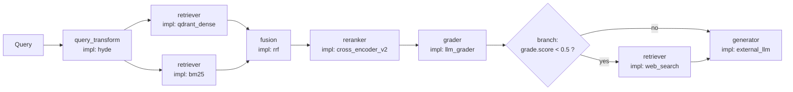
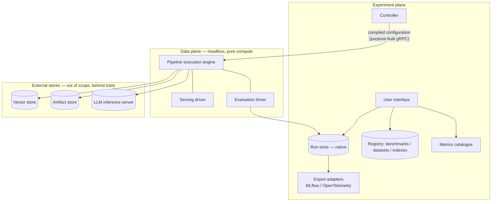
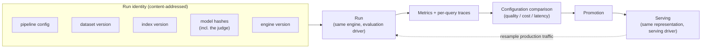
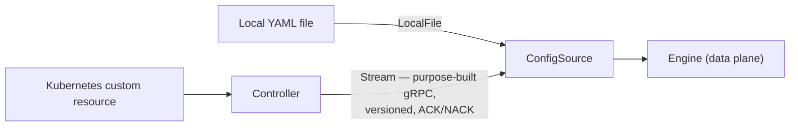
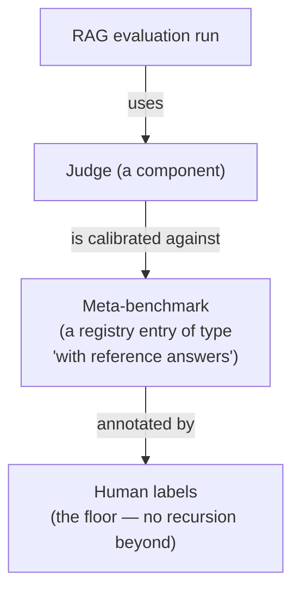

# System Architecture

| | |
|---|---|
| **Project** | RAG evaluation and serving platform (codename pending) |
| **Status** | Architecture proposal — submitted for review |
| **Version** | 0.2 |
| **Audience** | Software architects, technical reviewers, prospective contributors |
| **Document type** | Design document and architecture decision record (ADR) |
| **Companion document** | *Code Architecture* — the translation of this design into a Rust workspace |

> **How to read this document.** It describes a *target conceptual architecture*. No code has been written. Code excerpts (traits, protobuf, YAML) are **contract illustrations**, intended to make decisions concrete and reviewable — not frozen specifications.
>
> For a review, the most important sections are **§11 (decision record)**, **§12 (risks)** and **§13 (open questions)**. They state what was decided, what was deliberately rejected, and what remains intentionally unresolved.

---

## Table of contents

1. [Executive summary](#1-executive-summary)
2. [Context and problem statement](#2-context-and-problem-statement)
3. [Architectural thesis](#3-architectural-thesis)
4. [Guiding principles](#4-guiding-principles)
5. [The three contracts](#5-the-three-contracts)
6. [The three planes](#6-the-three-planes)
7. [The unification loop](#7-the-unification-loop)
8. [Configuration delivery](#8-configuration-delivery)
9. [The evaluation layer](#9-the-evaluation-layer)
10. [The in-process retrieval engine](#10-the-in-process-retrieval-engine)
11. [Scope and decision record](#11-scope-and-decision-record)
12. [Risks and mitigations](#12-risks-and-mitigations)
13. [Open questions](#13-open-questions)
14. [Glossary](#14-glossary)

---

## 1. Executive summary

This project is an open-source, cloud-native platform, written in Rust, for **building, serving, and — above all — evaluating and comparing Retrieval-Augmented Generation (RAG) systems**.

Its purpose is to answer, with reproducible numbers, the question every RAG practitioner actually faces:

> *Which RAG configuration performs best on my documents, at what cost and at what latency — and can I trust that measurement?*

**The central architectural claim** (§3) is that the platform must **not** implement "every RAG technique." It provides a **small core of orthogonal, composable primitives**, executed by a fast engine, from which most named techniques emerge as **configuration rather than code**.

The design rests on **three contracts** (§5) — a pipeline representation, a component contract, and a benchmark contract — organized into **three planes** (§6) — a headless data plane, an experiment plane, and external stores — bound together by a **content-addressed unification loop** (§7) that structurally eliminates *evaluation/serving skew*: what is benchmarked is exactly what is deployed.

The first deliverable (§11.3) is **not** a multi-tenant RAG-as-a-Service product. It is a **research-grade evaluation bench**, runnable locally with no Kubernetes, able to prove which retrieval configuration wins on a given corpus.

---

## 2. Context and problem statement

### 2.1 Three simultaneous problems

**Fragmentation.** RAG techniques — query transformation, hybrid retrieval, reranking, corrective RAG, agentic RAG, GraphRAG, RAPTOR — are scattered across dozens of frameworks, papers and ad-hoc implementations, and are rarely comparable to one another.

**No rigorous comparability.** No integrated tool answers the operational question that matters: *which configuration is best for my documents, at what cost and latency?* Practitioners choose techniques by reputation, not by measurement.

**A research-to-production gap.** Techniques are prototyped in Python under non-reproducible conditions. Porting them to performant serving is manual work that reintroduces divergence between what was measured and what is deployed.

### 2.2 What this project is not

Defining the system by negation is itself an architectural decision.

- **Not** a library that hardcodes every published RAG technique.
- **Not** a vector store. Qdrant, pgvector and their peers are consumed behind a trait, never reimplemented.
- **Not** an LLM serving engine. Existing inference servers are called, never reimplemented.
- **Not** (in v0) a multi-tenant RAG-as-a-Service product. That productization is layered on top of the core once the core is proven.

---

## 3. Architectural thesis

> **A small core of orthogonal, composable primitives, executed by a fast engine, from which most named RAG techniques emerge as configuration — accompanied by a curated set of ready-made recipes.**

### 3.1 Named techniques are compositions, not primitives

The founding observation is that the vast majority of "state-of-the-art RAG techniques" are not irreducible algorithms. They are **compositions or variations** of a small number of primitives:

| Technique family | Underlying primitive |
|---|---|
| HyDE, multi-query, step-back prompting | Query transformation |
| Reciprocal Rank Fusion, cross-encoder reranking, ColBERT late interaction | Fusion and scoring |
| Corrective RAG, self-RAG, adaptive RAG | **Control flow** (branch, bounded loop) around a pipeline |
| GraphRAG, RAPTOR | Multi-stage **indexing** pipelines producing derived artifacts |

Implementing "every technique" would therefore be a maintenance burden that misses the target entirely. The correct goal is to **identify the right primitives** and make everything else expressible by composition.

### 3.2 The quality metric of this architecture

The thesis yields a **measurable indicator of design quality**, to be used as a compass throughout the project's life:

> **The fraction of RAG techniques expressible without modifying the engine** — through configuration alone, or through a new component behind an existing contract.

The higher that fraction, the better the abstraction. Any technique that *forces* a change to the engine is a signal that the pipeline representation or the contracts are incomplete, and warrants reopening the design rather than patching the core.

---

## 4. Guiding principles

These are the invariants from which most subsequent decisions follow. Overturning one means overturning the architecture.

### P1 — One engine, several drivers (zero evaluation/serving skew)

A RAG pipeline is the **same computation** whether it serves one live query or evaluates ten thousand from a dataset. There is therefore **one engine**; only the feed differs, through *drivers*:

- **serving driver** — the engine receives live traffic;
- **evaluation driver** — the same engine, fed from a dataset, capturing metrics and traces.

**Why this is non-negotiable.** If the evaluation harness reimplemented the pipeline differently from the serving path, the platform would be benchmarking a system it never deploys — the benchmarks would be lies. This is the RAG analogue of train/serve skew, and the only structural defence is that **the benchmark travels exactly the same code path as production**. This principle *mandates* a single engine; it does not merely recommend one.

### P2 — Standalone first

The platform must be **fully usable locally**: run one binary with one configuration file and benchmark RAG pipelines on a laptop. The Kubernetes layer — custom resources, controller, cluster deployment — is an *addition*, never a prerequisite. This is what makes the tool adoptable by a researcher who has no cluster and no interest in acquiring one.

### P3 — Pure-compute data plane, externalized state

The data plane holds no durable state. Indexes, vectors and caches live in **external stores**. This preserves **horizontal scalability**: any data-plane replica can serve any request. Local caches are permitted as *reconstructible optimizations*, never as a source of truth.

### P4 — Content addressing and reproducibility

Every load-bearing entity — pipeline configuration, dataset, index, model — is identified by the **hash of its content**. An evaluation run is identified by the complete tuple of its inputs (§7.1). Without this, a bench is not a bench: its results cannot be reproduced, and therefore cannot be trusted.

### P5 — Agnostic at the edges, proprietary at the centre

The platform is **agnostic where the ecosystem is mature and interchangeable** — vector stores, LLM serving, behind traits — and **proprietary where its value lies**: orchestration, the pipeline representation, the engine, the retrieval hot path. We do not reinvent what exists; we own what differentiates.

---

## 5. The three contracts

The entire architecture rests on three contracts. They are the stable invariants; everything else is free to evolve behind them.

### 5.1 The pipeline representation

**Definition.** The data structure representing a RAG pipeline, **independent of the syntax used to write it** (YAML, programmatic builder) **and of how it is executed** (the engine). It is the analogue of an abstract syntax tree or a bytecode, but for RAG. **It is the central abstraction of the project.**

**Nature: a graph with control flow — not a linear pipeline, not a pure acyclic graph.**

This is the first structuring decision. A linear pipeline, or even a purely acyclic graph, cannot express corrective and agentic techniques (corrective RAG, self-RAG, adaptive RAG), which involve **branches and loops decided at runtime**: *"retrieval quality is poor → rewrite the query → retrieve again."* The representation therefore includes **first-class control-flow nodes**: conditional branches and bounded loops.

- **Nodes** — component invocations, or control-flow nodes.
- **Edges** — data flow.

**Illustration.** A hybrid retrieval pipeline with reranking, augmented with a corrective step:

```yaml
pipeline:
  nodes:
    - id: transform
      component: query_transform
      impl: hyde                    # a "named technique" is just an impl value

    - id: dense
      component: retriever
      impl: qdrant_dense
      inputs: [transform]
      params: { top_k: 50 }

    - id: sparse
      component: retriever
      impl: bm25                    # in-process sparse retrieval (§10)
      inputs: [transform]
      params: { top_k: 50 }

    - id: fuse
      component: fusion
      impl: rrf                     # Reciprocal Rank Fusion — a fusion impl,
      inputs: [dense, sparse]       # not dedicated engine code

    - id: rerank
      component: reranker
      impl: cross_encoder_v2        # may be Local OR Remote — the representation
      inputs: [fuse]                # does not distinguish them
      params: { top_k: 8 }

    - id: grade
      component: grader
      impl: llm_grader              # assesses retrieval quality
      inputs: [rerank]

    - id: gate                      # first-class control flow
      control: branch
      condition: "grade.score < 0.5"
      on_true: web_fallback         # the corrective step
      on_false: generate

    - id: web_fallback
      component: retriever
      impl: web_search
      inputs: [transform]
      next: generate

    - id: generate
      component: generator
      impl: external_llm            # calls an external inference server
      inputs: [rerank, web_fallback]
```



**The point to take away.** In this example, nearly every "state-of-the-art technique" has become either a value of the `impl:` field or a `control:` node. None required engine code. This is §3 made concrete.

### 5.2 The component contract

**Definition.** A component is a pipeline stage: chunker, embedder, indexer, retriever, fusion, reranker, context builder, generator, grader (the LLM judge), vector store. The contract is the **interface** that every component of a given kind satisfies, regardless of implementation. It has **two faces that must remain exact mirrors of one another**.

**Face 1 — the Rust trait** (in-process implementations, the hot path):

```rust
#[async_trait]
pub trait Reranker: Send + Sync {
    async fn rerank(
        &self,
        query: &Query,
        chunks: Vec<ScoredChunk>,
        params: &RerankParams,
    ) -> Result<Vec<ScoredChunk>, ComponentError>;
}
```

**Face 2 — the protobuf service** (remote implementations):

```proto
service Reranker {
  rpc Rerank(RerankRequest) returns (RerankResponse);
}

message RerankRequest {
  Query query = 1;
  repeated ScoredChunk chunks = 2;
  RerankParams params = 3;
}
```

**Two implementation natures behind one interface:**

```rust
// LOCAL — a cross-encoder loaded in-process (ONNX Runtime), on the hot path
struct LocalCrossEncoder { session: OrtSession }
impl Reranker for LocalCrossEncoder { /* direct inference */ }

// REMOTE — delegates to a third-party service (Python, or any language) over gRPC
struct RemoteReranker { client: RerankerClient }
impl Reranker for RemoteReranker {
    async fn rerank(&self, /* ... */) -> Result</* ... */> {
        // serialize to protobuf → gRPC call → deserialize.
        // The engine perceives NO difference from a local implementation.
    }
}
```

**Why this contract is the pivot of the entire project.**

The engine calls `reranker.rerank(...)` without knowing whether the implementation is native Rust or a Python service three network hops away. This externalization of a pipeline stage to a third-party process, behind a stable contract, is a well-established pattern in service proxies. Its consequence here is that the contract **determines the entire contribution funnel**:

- Researchers write Python, not Rust. A researcher with a new reranker writes **no Rust at all**: they implement the gRPC service, and their component is benchmarked **exactly like** a native one — same code path, same metrics, same run identity.
- The optimization path is clear and non-breaking: if a `Remote` component wins the benchmark and performance becomes critical, someone ports it to `Local` Rust. **Same contract, no change to any user's configuration.**

Without this two-faced contract, the platform would demand performant Rust from every contributor, and its contribution funnel would be a trickle. §10 explains why that tension exists in the first place.

### 5.3 The benchmark contract

**Definition.** A benchmark is structurally a **quadruple**:

```
Benchmark = corpus + queries + qrels + reference answers
             (docs)   (queries)  (relevance   (optional)
                                   judgments)
```

**Structuring decision.** The **presence or absence** of each piece **mechanically determines** which metrics are computable:

| Pieces present | Computable metrics | LLM judge required? |
|---|---|---|
| corpus + queries + **qrels** | Retrieval: recall@k, precision@k, MRR@k, MAP@k, **nDCG@k** | **No** — fully deterministic |
| corpus + queries + **reference answers** | Generation: comparison against reference | No, or partially |
| corpus + **queries only** | Generation: faithfulness, relevance | **Yes** — the noisiest regime |

**The benchmark adapter.** Every public benchmark has its own format — the BEIR schema, the CRAG schema with its mock APIs, and so on. A `BenchmarkAdapter` normalizes each external format into the internal structure above. Public benchmarks become supplied adapters; a custom benchmark means populating the same structure (§9.5).

This contract is the **data-side mirror of the component contract**: one stable interface, N implementations.

---

## 6. The three planes

Introducing a user interface, and choosing the research bench as the first product, forces a clean three-plane separation with disjoint responsibilities.



### 6.1 Data plane

- **Headless, pure compute, no durable state** (P3).
- Executes the pipeline representation through both drivers — serving and evaluation — guaranteeing the absence of skew (P1).
- **The user interface never touches it.** This separation is what allows the platform to have simultaneously a scalable, embeddable data plane *and* a complete product with a UI.

### 6.2 Experiment plane

Hosts all product-level state:

- the **run store** — history of runs, their metrics and their traces;
- the **registry** of benchmarks, datasets and indexes — versioned, typed entities;
- the **metrics catalogue**;
- **run comparison**;
- the **user interface**;
- **export adapters** to third-party experiment-tracking systems (§6.4);
- the **controller** — translating Kubernetes custom resources into wire configuration.

### 6.3 External stores

Out of scope, behind traits: **vector store** (Qdrant, pgvector); **artifact store** — needed because an index is *a set of derived artifacts*, not merely a table of vectors (a GraphRAG index is a graph; a RAPTOR index is a hierarchical tree); **LLM inference server**.

### 6.4 Run store: native, with export adapters

**Decision.** The run store is **native** — not built on an existing experiment-tracking platform such as MLflow. An **export trait** with at least one adapter (MLflow, OpenTelemetry / OpenInference) is provided.

**Rationale.** The general principle of consuming rather than reimplementing (P5) applies to substrates *beneath* our value — vector stores, inference servers. An experiment-tracking platform would sit *above* it: experiment comparison **is** the product's value, not a substrate. Three concrete frictions make the dependency inversion unworkable:

1. **The data model is too flat.** A run in a conventional tracker is scalar parameters, metrics, and opaque artifacts. A run here is a content-addressed tuple in which the configuration **is a graph**, and the central artifact is a **structured per-node execution trace**. One could store all of it as blobs, but then the tracker contributes only storage — and the link between the run and the graph, which is precisely what matters, is lost.
2. **The differentiating UI view becomes impossible.** Per-node execution replay (§6.5) cannot be expressed in a generic tracker's interface. It would have to be built alongside, fracturing the product into two interfaces.
3. **It inverts the dependency.** The experiment plane is one of the three planes of the system, and it contains the controller. Making it a plugin of an external platform is a structural problem, not merely a dependency choice.

Exporting rather than building upon preserves interoperability for teams already invested in an existing tracker, without surrendering the architecture. A run store fitted to this data model is a modest component; the expensive part is the interface, which must be built regardless.

### 6.5 The user interface

**A single front end.** Pipeline composition, benchmarking and execution replay live in **one interface**, not two juxtaposed tools.

**The load-bearing views** — these are the product, not decoration:

1. **Run comparison.** The diff between two configurations, with quality, cost and latency side by side. This answers the question the platform exists to answer.
2. **Per-node execution replay.** The pipeline graph rendered, with what actually happened overlaid on each node: what each retriever returned, how fusion reordered, what the reranker discarded, the final assembled context, and which branch the execution took.

The second view is the differentiating capability, and it is **a direct dividend of the graph representation** (§5.1). Because the representation *is* a graph, and traces are captured **per node**, the interface can draw the graph and superimpose the execution on it. **Debugging a RAG pipeline becomes visual.** No existing tool does this well.

**Authoring trajectory.** Node-based visual authoring (in the style of node-graph editors) is an explicit **two-step trajectory**, not indefinite polish:

- **Step 1 — the graph in read mode** (the replay view above). Load-bearing, part of the core.
- **Step 2 — visual graph editing.** Added later as an additional front end over the same representation. Once the graph can be rendered for reading, making it editable is an incremental extension.

**YAML-first authoring remains the primary path for v0.** The v0 audience is researchers, who want to version configurations in git, submit them as pull requests, and script fifty variants in a loop. For that user, a text file is a better tool than a canvas. The canvas serves the *next* audience.

**An identified risk.** Node-based editors conventionally manipulate acyclic graphs. This representation contains **branch and bounded-loop nodes**. Rendering control flow visually is a **hard interface-design problem**, not an implementation detail. It is tracked as such (§12).

---

## 7. The unification loop

This is the mechanism that makes the system **one product** rather than a data plane and a benchmarking tool glued together.

### 7.1 Run identity

An evaluation run is identified by the complete, content-addressed tuple of its inputs:

```
run_id = hash( pipeline_config, dataset_version, index_version,
               model_hashes, engine_version )
```

**`index_version` is non-negotiable.** An index is a **derived artifact** — produced from an indexing configuration applied to a corpus — and it must be **immutable, versioned and pinned** for a run to be reproducible. A serving deployment binds to a specific index version.

**`model_hashes` includes the judge.** The judge model, its prompt, its temperature and its seed enter run identity **on exactly the same footing as** the generator and the embedder. This is a consequence of treating the judge as a component (§9.3), and it is what enables mechanical self-preference detection (§9.6).



### 7.2 The product cycle

**Experiment → compare → promote → serve → resample.**

The configuration that wins the benchmark is **exactly** the configuration promoted to serving. The same artifact travels from the laptop to production without rewriting. This is P1 realized at the product level: the loop is closed, and every link in it is content-addressed.

### 7.3 Relationship to experiment-tracking concepts

| Conventional tracker concept | Equivalent here |
|---|---|
| Parameters | The pipeline configuration (hashed, and a *graph*) |
| Metrics | recall@k, nDCG@k, faithfulness, latency, cost |
| Artifacts | **Per-query execution traces** — retrieval, fusion, reranking, assembled context. The raw material of debugging. |
| Run | The content-addressed tuple of §7.1 |

**A difference of nature that must not be underestimated.** Conventional trackers record clean metrics — accuracy, loss. Here, a portion of the generation metrics rests on LLM-as-judge: non-deterministic, expensive, high-variance. Handling that variance rigorously (§9.7) is a problem conventional trackers never had to solve, and it is treated as a first-class concern rather than an afterthought.

---

## 8. Configuration delivery

The platform must be a data plane that **runs standalone** — a binary and a configuration file, with no cluster — while also being **declaratively configurable in Kubernetes** through custom resources and a controller. Achieving both without impedance between them is a design objective, not a coincidence.

### 8.1 Decision: a purpose-built gRPC service, not xDS

**A necessary clarification.** xDS and gRPC are not at the same level: **xDS runs on top of gRPC**. The real choice is therefore: *adopt the full xDS protocol — its resource schema and its state machine — or define a purpose-built gRPC configuration service.*

**What xDS provides.** xDS ("x Discovery Service") is the protocol used by mature network proxies for dynamic configuration. It supplies:

- **Typed resources** — listeners, routes, clusters, endpoints, secrets. Each with its own schema. Deeply network-centric.
- **An ACK/NACK state machine.** Each response carries a version and a nonce; the client acknowledges by echoing them, or rejects by keeping the previous version and attaching an error. The control plane therefore knows, resource by resource, whether application succeeded or failed.
- **Ordering guarantees.** Because resources have dependencies (a cluster must exist before a route referencing it, or traffic is dropped during the inconsistency window), an aggregated variant sends everything over a single stream to guarantee deterministic ordering. There are further refinements: resource warming, incremental (delta) versus state-of-the-world pushes.
- **Interoperability** with the surrounding proxy ecosystem.

**Decision: a purpose-built gRPC service.** Rationale:

1. **The xDS schema does not fit the domain.** Listeners, clusters and endpoints model network proxying. This platform pushes *RAG pipelines*. Reusing resources designed for something else means paying xDS's complexity without gaining its schema.
2. **The one genuine benefit of xDS — ecosystem interoperability — is worth nothing here.** Nothing in the world speaks "RAG configuration" in xDS. Adopting it would mean implementing the industry's most complex eventual-consistency state machine in order to interoperate with no one.
3. **Server-side xDS tooling in Rust is immature.** The state machine would have to be reimplemented. It is better to reimplement something *simple*.

**What is nevertheless borrowed from xDS** — its good *ideas*, not its schema: configuration versioning, **explicit ACK/NACK** (knowing whether the data plane actually applied a configuration), and possibly incremental push later. All of it fits in a purpose-built protobuf definition of a few dozen lines.

> **A candid reservation.** If the requirement ever becomes *"shard thousands of tenants across hundreds of data planes with fine-grained delta pushes,"* part of what xDS solves will have been reinvented. That bridge will be crossed with hindsight about actual requirements, rather than by pre-paying the complexity today.

### 8.2 The `ConfigSource` abstraction

Three rules, taken directly from mature proxy design:

1. **The data plane exposes a `ConfigSource` abstraction**, with several implementations:
   - `LocalFile` — a static YAML file (standalone mode, P2);
   - `Stream` — pushed from the controller over the purpose-built gRPC service.

   **The data plane does not know who configures it.**

2. **The custom-resource schema is the native configuration** (or a trivial derivation of it). A developer works locally with a file, then deploys to Kubernetes **without changing anything**. Zero impedance.

3. **The controller only translates** — custom resource in, wire configuration out.



### 8.3 The custom resource is a serialization of the pipeline representation

The Kubernetes custom resource is **nothing other than a serialization of the pipeline representation**, modulo the wire format. This is what makes *standalone first* (P2) coherent rather than aspirational: **the YAML run locally *is* the custom resource.**

---

## 9. The evaluation layer

This is the platform's central differentiator and its scientific core. The bench must answer credibly: *which configuration wins, on which data, at what cost — and can the measurement be trusted?*

### 9.1 Two families of benchmarks

A review of the state of the art (2024–2026) confirms the existence of mature RAG benchmarks, in **two families of fundamentally different natures**. This distinction is load-bearing for the architecture.

**Family 1 — retrieval benchmarks.** BEIR (18 heterogeneous datasets, zero-shot evaluation; now integrated as the retrieval portion of MTEB) provides public, objective, reproducible leaderboards. Metrics: **nDCG@10, MRR@k**, computed from *qrels* — relevance judgments produced in advance.

> **The strategic consequence is major.** These metrics require **no LLM judge**. The computation is deterministic and unnoised. By beginning the bench with the *retrieval* half, the entire LLM-as-judge problem **simply does not arise**. A scientifically credible bench — hybrid versus dense versus sparse versus reranked — can be delivered without ever invoking a judge. This is the most defensible possible v0.

**Family 2 — end-to-end RAG benchmarks.** These evaluate the full retrieval-to-generation chain and carry question/answer pairs, requiring either a reference answer or a judge:

- **CRAG** (KDD Cup 2024) — 4,409 Q/A pairs across five domains and eight question categories, with **mock APIs** simulating web search and knowledge-graph lookups; answers scored as perfect / acceptable / missing / incorrect.
- **MultiHop-RAG** — multi-hop reasoning, with evidence distributed across several documents.
- **RGB, RECALL, MIRAGE, LiveRAG** — robustness, counterfactuals, varying difficulty.

> **An idea worth borrowing from CRAG: the mock APIs.** One does **not** benchmark against the live web, which is non-deterministic. A snapshot is frozen, preserving reproducibility (P4).

### 9.2 Benchmark ≠ evaluation framework

This is the most important vocabulary distinction in the project, and getting it wrong misallocates the entire effort. "Implementing the recognized benchmarks" spans **two distinct layers**:

- **Benchmarks** — the data plus the ground truth: BEIR, CRAG, MultiHop-RAG.
- **Evaluation frameworks** — the layer that **computes metrics**, often via a judge: RAGAS (faithfulness, relevance, context precision and recall), ARES (lightweight fine-tuned LLM judges, requiring on the order of 150 human annotations to calibrate), RAGChecker (fine-grained retrieval and generation analysis).

> **This platform *is* an evaluation framework that *consumes* benchmarks.** RAGAS, ARES and RAGChecker are therefore **not competitors to reimplement** — they define the layer being built. Their **metric definitions** are borrowed rather than reinvented.

The distinction structures the experiment plane into two registers: a **benchmark registry** (data) and a **metrics catalogue** (computation).

**A signal from the literature that vindicates caution.** In recent publications, traditional deterministic metrics still dominate practice, while LLM-based evaluation methods have not achieved broad acceptance — attributed to the simplicity and reliability of the conventional metrics. The research community itself is wary of the judge. The bench must therefore treat **label-based metrics as the foundation** and the judge as a **separate, calibrated, optional instrument**.

### 9.3 The judge is a component

**Structuring decision.** The LLM judge is not a special case. It is a **component of the pipeline representation**, carrying its model hash, its prompt, its temperature and its seed.

The consequences cascade elegantly:

- **An evaluation run that uses a judge is itself a pipeline**, executed by the engine, versioned and content-addressed like everything else.
- **The judge becomes an experiment variable** — which judge model? which prompt? which temperature? — and can therefore be benchmarked in turn.
- Structurally, the judge is the near-twin of the generator: both are "LLM call" components, typically `Remote`, sharing the same substrate. The judge takes `(query, answer, context)` and emits a score, reusing the generator's entire machinery. **One more non-duplication.**

### 9.4 Why the recursion terminates

Treating the judge as a component invites the objection of infinite regress: if the judge is evaluated by the engine, who evaluates the judge that evaluates the judge?

It dissolves, because **the recursion has exactly one level of depth and bottoms out on human labels.**

Calibrating a judge requires a **meta-benchmark**: triples of `(answer, context, human quality label)`. Calibration means running the judge pipeline against that meta-benchmark and **measuring its agreement with the human** (correlation, Cohen's kappa). But that meta-benchmark is **merely one more entry in the registry**, of the "with reference answers" type. The regress stops there: at the bottom level, a human annotated. **The judge is not a foundation; it is a calibrated proxy for a small human bedrock.**



### 9.5 Recognized benchmarks first, custom benchmarks next

**Sequence.** Implement the recognized public benchmarks first, through adapters; then allow users to create their own. The second phase is **not a convenience feature**. It is justified by two hard scientific problems:

1. **Contamination.** Public benchmarks progressively leak into model training data. A public benchmark ages: scores rise because the model has seen it, not because the system improved.
2. **Non-representativeness.** A model topping a public leaderboard can underperform on a specific domain. A leaderboard result is a **ceiling**, to be validated against baselines **on one's own held-out data**.

This is the real product argument for custom benchmarks: the public benchmark answers *"what is the state of the art in the abstract"*; the custom benchmark answers *"what wins on **my** documents"* — and it is the second question that brings a user back. **Synthetic Q/A generation** from a corpus is the bridge to custom benchmarks, with its **circular bias documented honestly** rather than glossed over.

### 9.6 Mechanical self-preference detection

Because the judge **and** the generator are both components, each carrying a `model_hash`, the **self-preference bias** — a model scoring its own outputs favourably — becomes **mechanically detectable**: the engine compares the two hashes and **raises a warning when the judge and the generator are the same model**.

One of the most insidious bugs in RAG evaluation moves from *"a silent error nobody notices"* to *"an assertion the engine can check."* This capability is obtained for free, purely as a consequence of refusing to treat the judge as a special case (§9.3) — and it is the kind of property that earns a bench credibility with researchers.

### 9.7 Statistical rigour, and the limits of reproducibility

When the judge is introduced, it is treated as a **measuring instrument**: versioned (model hash, prompt, parameters), with **seeds**, **confidence intervals**, cheaper proxies where appropriate, and **calibration against a small human-annotated set** (§9.4).

**A limit the platform states honestly rather than papering over.** An LLM served with dynamic batching is **not deterministic even at a fixed seed**: the floating-point reduction order varies with batch composition. Strict reproducibility of a judge-based run therefore **cannot be guaranteed**, and the platform does not promise it.

What it does guarantee:

- **Complete traceability** — everything that ran is recorded: model, prompt, temperature, seed, version.
- **Statistical reproducibility** — replicates, with confidence intervals on scores.

A serious bench states this nuance rather than promising a determinism it cannot deliver. Without confidence intervals, configuration rankings are noise dressed as science — disqualifying for a research audience.

### 9.8 Calibrating the harness against a published leaderboard

Implementing the metric formulas is necessary but not sufficient: a metrics library is trusted only once it **reproduces a published score**, because that is the only check that also exercises encoding, pooling and search — not just arithmetic.

**The corpus/queries/qrels model, and where the heterogeneity actually lives.** Every BEIR/MTEB retrieval dataset reduces to the same logical shape — a document corpus, a query set, and qrels linking them — but its physical packaging on Hugging Face varies: `.jsonl` versus `parquet`, `dev` versus `test` splits, language-prefixed subsets, multi-subforum aggregates (CQADupstack averages 12 sub-datasets into one published score), and per-query-sampled "hard negative" corpora that break the assumption of a single global corpus. A `BenchmarkAdapter` (§5.3) absorbs all of this heterogeneity once, in the layer where the conversion tooling already exists, so that the engine and the metrics layer see exactly one canonical shape regardless of source. Two pitfalls recur across every adapter and are worth stating as standing implementation rules rather than per-dataset lore: **ids are strings, never parsed as numbers** (leading zeros are significant), and **the dataset's Hugging Face revision is pinned**, because a published score is attached to a specific commit, not to a dataset name.

**The reproduction procedure.** Freeze a small calibration case — SciFact (binary relevance) first, then NFCorpus (graded relevance, which alone can expose a linear-versus-exponential gain bug) — encode it exactly as the reference model's card specifies (instruction prefixes, `title + text` concatenation, pooling, L2 normalization, truncation length), search it **exactly** (brute force, never the production ANN index — an approximate index would make any discrepancy undiagnosable), and compare nDCG@10 against the published figure:

| Gap to the published score | Interpretation |
|---|---|
| < 0.5 point | Pipeline validated |
| 1–5 points | Almost always an encoding mismatch: prompt prefix, pooling, or normalization |
| > 10 points | Wrong split, wrong revision, or ids that fail to match between run and qrels |

This reproduction is a one-time gate, but its by-products are permanent: the frozen run, its qrels and the expected scores (cross-checked against `pytrec_eval`, the library BEIR itself evaluates with) become CI regression fixtures. The calibrated exact-search pipeline then becomes the baseline against which a production ANN index's cost is measured on an ongoing basis: replaying the same dataset through that index and comparing recall@k against the exact-search figure yields the recall lost to approximation — a number to monitor continuously, independent of which embedding model is chosen (ADR-10).

---

## 10. The in-process retrieval engine

The choice of Rust is an **architectural** advantage, not a stylistic one. It allows the platform to **own the retrieval hot path in-process** rather than orchestrating a constellation of sidecars.

**What runs in-process:**

- **tantivy** — native BM25 and sparse retrieval, with no Elasticsearch sidecar.
- **candle** or **ONNX Runtime** — embedders, cross-encoder rerankers, SPLADE, late-interaction models, executed **inside the process**, with no Python sidecar.
- **Arrow / Parquet** — the artifacts and datasets layer.

BM25, dense, sparse and reranking, **all in-process**, asynchronous, with continuous batching of embedding calls. This is not available to any Python-based RAG framework. **This is the platform's core technical differentiator** — the hard-problem abstraction that justifies building it at all.

**What is deliberately not reimplemented** (P5): the vector store (behind a trait) and the LLM inference server (called over the network).

**An assumed tension, and its structural resolution.** Researchers write Python. If contributing required performant Rust, the contribution funnel would be a trickle — and a benchmarking platform with no contributed techniques is a benchmarking platform with nothing to benchmark. The `Local`/`Remote` component contract (§5.2) is the **structural answer**: contribution is possible in Python (`Remote`), with a non-breaking optimization path to Rust (`Local`). The funnel is wide **and** the hot path stays fast.

---

## 11. Scope and decision record

### 11.1 In scope / out of scope

| In scope | Out of scope (behind traits) |
|---|---|
| The pipeline representation, engine, serving and evaluation drivers | Vector store (Qdrant, pgvector) |
| The component and benchmark contracts | LLM inference server |
| The registry (benchmarks / datasets / indexes) | Artifact store (physical backend) |
| The metrics catalogue and the native run store | — |
| Export adapters to third-party trackers | — |
| Configuration gRPC service, controller, custom resources | — |
| The user interface (run comparison, per-node replay) | Visual graph *editing* (v0 is YAML-first) |

### 11.2 The chosen first audience

**The research bench comes before the multi-tenant service.** A benchmarking suite that is credible on its own — runnable locally, with no cluster, no tenancy, no judge — is a complete and defensible product. Multi-tenant RAG-as-a-Service is a productization layered on top of that proven core, and it introduces isolation, quota and security questions that are deliberately deferred (§13).

### 11.3 The minimal vertical slice for v0

**The principal risk to this project is the coherence of its own architecture.** The design is broad, and its elegance can disguise the fact that v0 must fit into something **small and undeniably useful**. A platform that tries to ship the full architecture at once ships nothing.

**Recommended minimal vertical slice:**

> An engine executing a **hybrid retrieval** pipeline, benchmarked on **BEIR**, with a **two-configuration comparison view**.
>
> **No** judge. **No** generation. **No** Kubernetes. **No** control flow.
>
> Objective: prove that *hybrid retrieval with reranking* outperforms *dense-only retrieval* on a given corpus, **with reproducible numbers**.

Everything else in this architecture is an **extension of that core**, and every extension already has a reserved place in this document.

### 11.4 Architecture decision record

| # | Decision | Alternatives rejected | Rationale |
|---|---|---|---|
| **ADR-1** | Composable primitives plus an engine; techniques are configuration | Hardcode each published technique | Maintainability; techniques are compositions (§3) |
| **ADR-2** | The pipeline representation is a **graph with control flow** | Linear pipeline; pure acyclic graph | The only way to express corrective and agentic RAG (§5.1) |
| **ADR-3** | **Two-faced component contract** (Rust trait + protobuf), `Local` / `Remote` | Rust-only; dynamic plugin loading | Wide contribution funnel plus a non-breaking optimization path (§5.2, §10) |
| **ADR-4** | **One engine**, serving and evaluation drivers | A separate evaluation harness | Structurally eliminates evaluation/serving skew (P1) |
| **ADR-5** | **Pure-compute data plane**, externalized state | Stateful data plane | Preserves horizontal scalability (P3) |
| **ADR-6** | **Purpose-built gRPC configuration delivery** | Full xDS protocol | xDS schema unsuited to the domain; its interoperability benefit worth nothing here; Rust tooling immature (§8.1) |
| **ADR-7** | **Custom resource = serialization of the representation**; `ConfigSource` abstraction | A Kubernetes-native format distinct from the local one | Standalone-first; zero impedance between local and cluster (P2, §8) |
| **ADR-8** | **Benchmark contract** typed by the presence of qrels and reference answers | A single flat dataset format | The pieces present determine the computable metrics (§5.3) |
| **ADR-9** | **The judge is a component** of the representation | A judge hardcoded in the evaluation harness | Judge as calibrated experiment variable; enables self-preference detection (§9.3–9.6) |
| **ADR-10** | **Deterministic retrieval metrics first, judge later** | Full end-to-end evaluation from v0 | Credibility without depending on a noisy instrument (§9.1) |
| **ADR-11** | **Research bench before multi-tenant service** | Multi-tenant service first | A benchmarking core must be proven before productization (§11.2) |
| **ADR-12** | **UI in the experiment plane, never in the data plane** | UI coupled to the data plane | Headless scalable data plane *and* a complete product, without tension (§6) |
| **ADR-13** | **Native run store with export adapters** | Build on an existing experiment tracker | Data model too flat for a graph-shaped config; per-node replay inexpressible; inverts the plane dependency (§6.4) |
| **ADR-14** | **Single front end**; graph replay is load-bearing, visual authoring is a later trajectory | Separate benchmarking tool; visual authoring in v0 | One coherent product; YAML serves the v0 research audience better (§6.5) |
| **ADR-15** | **Traceability and statistical reproducibility, not strict determinism** | Promise deterministic judge-based runs | LLM non-determinism under dynamic batching is irreducible (§9.7) |

---

## 12. Risks and mitigations

| Risk | Severity | Architectural mitigation |
|---|---|---|
| **Evaluation/serving skew** — benchmarks unrepresentative of production | Critical | One engine, one code path (P1, ADR-4) |
| **Over-engineering; a v0 that is too ambitious** | High | The minimal vertical slice is mandated (§11.3); the quality metric of §3.2 acts as a guardrail |
| **Noisy, untrustworthy LLM judge** | High | Deterministic retrieval metrics first; judge treated as a calibrated instrument (seeds, confidence intervals, human meta-benchmark); self-preference detection (§9) |
| **Narrow contribution funnel** — a Rust wall | High | The `Local`/`Remote` contract makes Python contribution first-class (§5.2, §10) |
| **Non-reproducible runs** | High | Full content addressing; index versioned and pinned (P4, §7.1) |
| **Public benchmark contamination** | Medium | Custom-benchmark phase and synthetic generation (§9.5) |
| **Visual control-flow rendering** — node editors assume acyclic graphs | Medium | Tracked as an open design problem; deferred to the visual-authoring milestone (§6.5, §13) |
| **The UI consuming the schedule** | Medium | Load-bearing views (run comparison, per-node replay) distinguished from polish (visual editing); YAML-first (§6.5) |
| **Configuration complexity at scale** — many tenants, delta pushes | Medium (deferred) | Consciously deferred; crossed at real need rather than pre-paid (§8.1) |

---

## 13. Open questions

### Deliberately unresolved design questions

These do not invalidate the architecture but must be settled before the work they gate.

- **Does indexing share the pipeline formalism?** Current leaning: **yes** — one formalism, two graphs (a batch indexing graph and an online serving graph). This would make **indexing strategies themselves** — GraphRAG versus RAPTOR versus naive chunking — benchmarkable as experiment variables, on the same footing as retrieval strategies. It would also extend the skew-free guarantee to the indexing path. **This is the least-settled part of the architecture and must be formally validated before the custom-benchmark work.**
- **Physical location of derived artifacts** — the GraphRAG graph, the RAPTOR tree — relative to vectors, within the artifact store.
- **Data-plane cache policy.** Local caches (embedding, retrieval, context prefix) must remain reconstructible optimizations and never a source of truth, to preserve P3. The invalidation model is undefined.

### Deferred: implementation sequencing, no architectural impact

- **Loops versus branches in v0.** Branches suffice initially; bounded loops (self-RAG's "retrieve again until threshold") require state management and a termination guard. Enable once the executor is solid.
- **Which generator to ship first** — an external `Remote` call, or a small `Local` model.
- **Controller implementation language** — Go or Rust. A clean network boundary either way.
- **Text-only versus multi-modal.** Multi-modal RAG benchmarks exist, but multi-modality is an extension, not a foundation.

### The next major undertaking, of a different nature

- **Multi-tenant RAG-as-a-Service.** Tenant isolation, quotas, security, index sharing — **questions not yet opened**, deliberately deferred until the research bench is proven.

---

## 14. Glossary

**Benchmark adapter** — A component normalizing an external benchmark format (BEIR, CRAG) into the internal quadruple: corpus + queries + qrels + reference answers.

**Component** — A pipeline stage (chunker, embedder, retriever, fusion, reranker, context builder, generator, grader) satisfying a two-faced contract: a Rust trait and a protobuf service.

**`ConfigSource`** — The data plane's configuration-source abstraction: `LocalFile` or `Stream`.

**Content addressing** — Identifying an entity by the hash of its content. The foundation of reproducibility.

**Control flow** — Branch and bounded-loop nodes in the pipeline representation; what makes corrective and agentic RAG expressible as configuration.

**Custom resource (CRD)** — A Kubernetes resource definition; here, a serialization of the pipeline representation.

**Data plane** — The headless, pure-compute plane executing the pipeline representation.

**Evaluation/serving skew** — Divergence between the evaluation code path and the serving code path, rendering benchmarks unrepresentative. Eliminated by the single engine.

**Experiment plane** — The plane hosting the registry, run store, metrics catalogue, export adapters, controller and user interface.

**`Local` / `Remote`** — The two implementation natures of a component: in-process Rust (hot path), or a remote gRPC service (any language).

**Meta-benchmark** — A dataset of `(answer, context, human label)` triples used to calibrate a judge against human agreement.

**Pipeline representation** — The graph-with-control-flow data structure describing a RAG pipeline, independent of syntax and execution. The central abstraction.

**qrels** — Query relevance judgments: query-to-document relevance labels. The basis of deterministic retrieval metrics.

**Self-preference** — The bias of an LLM judge scoring its own outputs favourably. Made mechanically detectable by comparing model hashes.

---

*End of document. Sections §11.4, §12 and §13 constitute the core of the review: they set out the decisions taken, the risks assumed, and the questions left deliberately open.*